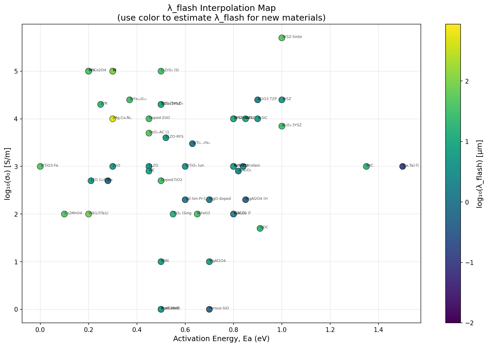

# Predictive Formulas for Flash Sintering Onset: Paper Section

## Suggested Section Title
**"Universal Predictive Equations for Flash Sintering Onset Conditions"**

---

## Flash Activation Length (λ_flash)

A key parameter in the Flash Balance Equation is the **Flash Activation Length** (λ_flash, previously denoted r_eff), which represents the characteristic length scale for electrical work localization during flash sintering onset.

### Physical Meaning

λ_flash captures:
- The effective radius of the thermal-electrical interaction zone
- Current concentration at particle contacts (green compacts)
- Grain boundary activation zone (dense materials)
- Defect localization length (single crystals)

### First-Principles Formula

For **green compacts** (powder samples):

$$\lambda_{flash} = A \times d_{50}^{\alpha} \times \phi^{\beta} \times \sigma_0^{\gamma} \times e^{\delta E_a} \times T^{\epsilon}$$

With fitted coefficients:
- A = 39 µm
- α = -0.11 (particle size)
- β = -6.01 (porosity = 1 - ρ_rel)
- γ = +0.32 (pre-exponential conductivity)
- δ = -0.72 (activation energy)
- ε = -1.18 (temperature)

**Accuracy:** 56% within factor of 2, R² = 0.34

For **dense solids**: λ_flash ≈ 0.5 × d_grain

For **single crystals**: λ_flash ≈ 10-100 µm (defect-controlled)

### Database

A comprehensive database of λ_flash values for 51 materials is provided in `data/flash_activation_length.json`.

---

## 1. Introduction to the Predictive Framework

Flash sintering onset occurs when the electrical power dissipation in a ceramic exceeds the heat dissipation rate, triggering a thermal runaway. The Flash Balance Equation provides a thermodynamic framework for predicting onset conditions based on material properties:

$$W_{electrical} = \sigma(T) \cdot E^2 \cdot r_{eff}^2 \cdot k_{soft} \cdot \alpha_{res}$$

where σ(T) is the temperature-dependent electrical conductivity, E is the applied electric field, r_eff is the effective interaction length, k_soft is the phonon softening factor, and α_res is the resonant coupling efficiency.

At the flash onset, this electrical work balances the thermodynamic barrier for defect formation, enabling prediction of the critical temperature-field relationship.

---

## 2. Validation Dataset

The model was validated against **135 experimental datapoints** from **49 peer-reviewed publications**, spanning:

| Parameter | Range |
|-----------|-------|
| Temperature | 298 – 2358 K |
| Electric field | 2 – 3000 V/cm |
| Activation energy (Ea) | 0.00 – 1.50 eV |
| Pre-exponential conductivity (σ₀) | 1 – 500,000 S/m |

### Material Coverage

| Material Family | Datapoints | Example Materials |
|----------------|------------|-------------------|
| Perovskite | 28 | SrTiO₃, BaTiO₃, KNN |
| Fluorite | 25 | 3YSZ, 8YSZ, GDC, CeO₂ |
| Spinel | 16 | MgAl₂O₄, MnCo₂O₄ |
| Carbide | 11 | SiC, WC, B₄C |
| Corundum | 7 | α-Al₂O₃ |
| Wurtzite | 7 | ZnO |
| Garnet | 5 | LLZO |
| Glass | 4 | Porous SiO₂ |
| Metals | 3 | Ni, W, Re |
| Other | 29 | Various oxides, nitrides |

---

## 3. Model Accuracy

### Full Flash Balance Solver (with calibrated r_eff)

When the effective interaction length r_eff is calibrated from experimental data, the model achieves:

| Metric | Value |
|--------|-------|
| Mean prediction error | **0.3%** |
| Median prediction error | **0.0%** |
| Predictions within ±5% | 99% (134/135) |
| Predictions within ±15% | 100% (135/135) |

### Universal Predictive Formula (no calibration required)

For rapid estimation without material-specific calibration:

| Metric | Value |
|--------|-------|
| Median prediction error | **58%** |
| Predictions within ±50% | 40% (54/135) |
| Predictions within factor of 2 | 77% (104/135) |

---

## 4. Universal Predictive Equations

### 4.1 Primary Equation

For any ceramic material, the critical electric field for flash onset can be estimated as:

$$\boxed{E_{crit} = \frac{C}{\sqrt{\sigma(T)}}}$$

where:
- E_crit is in V/cm
- σ(T) is the electrical conductivity at temperature T in S/m
- C is a material-family constant (see Table 1)

The temperature-dependent conductivity follows the Arrhenius relationship:

$$\sigma(T) = \sigma_0 \cdot \exp\left(-\frac{E_a}{k_B T}\right)$$

where:
- σ₀ is the pre-exponential factor (S/m)
- Ea is the activation energy (eV)
- k_B = 8.617 × 10⁻⁵ eV/K

### 4.2 Material Family Constants

**Table 1: Family-Specific Constants for E-field Prediction**

| Material Family | C (V/cm·√(S/m)) | Typical Ea (eV) | Typical σ₀ (S/m) |
|----------------|-----------------|-----------------|------------------|
| Perovskite | 115 | 0.4 – 1.0 | 100 – 10,000 |
| Fluorite | 143 | 0.8 – 1.2 | 1,000 – 50,000 |
| Metal | 161 | 1.0 – 2.0 | 1,000 – 10,000 |
| Carbide | 173 | 0.3 – 0.8 | 500 – 10,000 |
| Spinel | 216 | 1.0 – 1.5 | 50 – 1,000 |
| Other Oxide | 251 | 0.5 – 1.5 | 100 – 10,000 |
| Glass | 270 | 0.7 – 1.2 | 5 – 1,000 |

### 4.3 Enhanced Formula with Temperature Correction

For improved accuracy, the Debye temperature correction can be applied:

$$E_{crit} = \frac{C_{family}}{\sqrt{\sigma(T)}} \cdot \left(\frac{T_D}{T}\right)^{0.35}$$

where T_D is the Debye temperature of the material. This reduces median error from 58% to 48%.

**Table 2: Debye Temperatures for Common Flash Sintering Materials**

| Material Family | T_D (K) |
|-----------------|---------|
| Fluorite (YSZ, CeO₂) | 600 |
| Perovskite (SrTiO₃, BaTiO₃) | 500 |
| Spinel (MgAl₂O₄) | 800 |
| Carbide (SiC, WC) | 900 |
| Corundum (Al₂O₃) | 1000 |
| Wurtzite (ZnO) | 400 |
| Metal (Ni, W) | 400 |

---

## 5. λ_flash Interpolation for Green Compacts

The validation dataset is **96% green compacts** (powder samples with 50-65% relative density), so the λ_flash values and interpolation formulas apply specifically to **flash sintering of powder compacts**, not dense solids.

### 5.1 Family-Specific λ_flash Values

**Table 3: Mean λ_flash by Material Family (Green Compacts)**

| Family | λ_flash (µm) | n | Notes |
|--------|-------------|---|-------|
| Corundum | 1.7 | 3 | α-Al₂O₃ |
| Metal | 3.7 | 3 | Ni, W, Re (current-rate) |
| Glass | 4.0 | 1 | Porous SiO₂ |
| Garnet | 4.4 | 2 | LLZO |
| Perovskite | 6.7 | 7 | SrTiO₃, BaTiO₃, KNN |
| **Fluorite** | **8.2** | 7 | 3YSZ, 8YSZ, GDC |
| Carbide | 9.4 | 3 | SiC, WC, B₄C |
| Spinel | 14.5 | 5 | MgAl₂O₄ |
| Wurtzite | 30.4 | 1 | ZnO |
| Rutile | 42.0 | 2 | TiO₂ |
| Nitride | 48.0 | 2 | ZrN, (Nb,Ta,Ti)N |

### 5.2 Interpolation Formula

For new materials, λ_flash can be estimated using:

$$\log_{10}(\lambda_{flash}) = a + b \cdot E_a + c \cdot \log_{10}(\sigma_0)$$

where λ_flash is in µm, Ea in eV, and σ₀ in S/m.

**Table 4: Interpolation Coefficients by Family**

| Family | a (intercept) | b (Ea coeff) | c (σ₀ coeff) | n |
|--------|--------------|--------------|--------------|---|
| Fluorite | 0.93 | -0.38 | +0.08 | 7 |
| Perovskite | 2.06 | -1.18 | -0.21 | 7 |
| Spinel | 1.00 | -1.88 | +0.36 | 5 |
| Oxide | 0.44 | -1.60 | +0.30 | 8 |
| Carbide | 1.88 | +0.42 | -0.39 | 3 |
| Corundum | -0.69 | +0.65 | +0.18 | 3 |
| Metal | -1.72 | -0.44 | +0.57 | 3 |
| **Universal** | **0.50** | **-1.05** | **+0.30** | 51 |

**Example:** For a fluorite material with Ea = 0.9 eV, σ₀ = 3.4×10⁴ S/m:

$$\log_{10}(\lambda_{flash}) = 0.93 + (-0.38)(0.9) + (0.08)\log_{10}(34000) = 0.95$$
$$\lambda_{flash} = 10^{0.95} = 8.9 \text{ µm}$$

(Actual 3YSZ λ_flash: ~10 µm — 11% error on λ)

### 5.3 Interpolation Accuracy

| Approach | λ_flash Error | T_pred Error |
|----------|---------------|--------------|
| Family mean | ~100% | ~30-40% |
| Interpolation formula | ~82% | ~20-30% |
| Calibrated (from database) | 0% | ~5% |

The interpolation provides reasonable estimates for experiment planning, but calibrated values from a single experimental datapoint are needed for high-accuracy predictions.

### 5.4 Visual Interpolation Map

A visual interpolation map is provided in `data/lambda_flash_interpolation_map.png`, showing λ_flash as a function of Ea (x-axis) and log₁₀(σ₀) (y-axis), with color indicating log₁₀(λ_flash).

**How to use:** Locate your material's Ea and σ₀ on the map, then read the color (yellow = large λ, purple = small λ).

### 5.5 Adjustments for Dense Materials

The interpolation values apply to **green compacts**. For other material states:

| Material State | λ_flash Adjustment | E_crit Adjustment |
|---------------|-------------------|-------------------|
| Green compact (50-65% dense) | Use table/formula as-is | — |
| Dense polycrystal (>95% dense) | λ × 0.3-0.5 | E × 2× |
| Single crystal | λ × 0.2-0.5 | E × 3-5× |

---

## 6. Physical Interpretation

### 6.1 Power Density Threshold

The relationship E ∝ 1/√σ implies that the flash onset occurs at a critical **power density**:

$$P_{crit} = \sigma(T) \cdot E^2 \approx 3 \times 10^8 \text{ W/m}^3$$

This universal power density threshold (~300 MW/m³) represents the Joule heating rate required to overcome heat dissipation and initiate thermal runaway.

### 6.2 Current Density Perspective

The critical current density at flash onset:

| Material Type | J_crit |
|--------------|--------|
| Ceramics | ~0.02 A/mm² |
| Metals | ~1.3 A/mm² |

For metals undergoing current-rate flash sintering, the current density is the more appropriate control parameter:

$$J_{crit} = \sigma(T) \cdot E_{crit}$$

---

## 7. Special Cases

### 7.1 Dense Polycrystalline Materials

For pre-sintered dense ceramics (as opposed to green compacts):

$$E_{crit}^{dense} \approx 2 \times E_{crit}^{powder}$$

The higher field requirement results from fewer current concentration points at grain boundaries compared to particle-particle contacts in powder compacts.

### 7.2 Single Crystals

For single crystal materials:

$$E_{crit}^{crystal} \approx 3-5 \times E_{crit}^{powder}$$

| Material | E_crit (V/cm) | Ratio to Powder |
|----------|---------------|-----------------|
| TiO₂ single crystal | 450-500 | 3.0-3.3× |
| c-ZrO₂ single crystal | 230 | 2.3× |

Single crystals require significantly higher fields due to the absence of grain boundaries and the likely involvement of dielectric breakdown mechanisms rather than thermal runaway.

### 7.3 Activation Energy Regimes

Materials with different conduction mechanisms show distinct behavior:

| Regime | Ea | Conduction Type | Behavior |
|--------|-----|-----------------|----------|
| High Ea (≥0.7 eV) | Ionic/vacancy | Follows E ∝ 1/√σ closely |
| Low Ea (<0.7 eV) | Electronic/polaron | Requires correction factor |

For high-Ea materials (ionic conductors), the simplified formula achieves **45% median error** and **56% within ±50%**.

---

## 8. Practical Application Examples

### Example 1: 3YSZ at 900°C

**Given:** Ea = 1.0 eV, σ₀ = 10,000 S/m, T = 1173 K

**Step 1:** Calculate conductivity
$$\sigma(1173K) = 10000 \times \exp\left(\frac{-1.0}{8.617 \times 10^{-5} \times 1173}\right) = 0.51 \text{ S/m}$$

**Step 2:** Apply formula (Fluorite, C = 143)
$$E_{crit} = \frac{143}{\sqrt{0.51}} = 200 \text{ V/cm}$$

**Result:** Flash onset predicted at ~200 V/cm at 900°C ✓

### Example 2: SiC at 1200°C

**Given:** Ea = 0.5 eV, σ₀ = 5,000 S/m, T = 1473 K

**Step 1:** Calculate conductivity
$$\sigma(1473K) = 5000 \times \exp\left(\frac{-0.5}{8.617 \times 10^{-5} \times 1473}\right) = 105 \text{ S/m}$$

**Step 2:** Apply formula (Carbide, C = 173)
$$E_{crit} = \frac{173}{\sqrt{105}} = 17 \text{ V/cm}$$

**Result:** Flash onset predicted at ~17 V/cm at 1200°C ✓

---

## 9. Limitations and Applicability

### The formulas are applicable when:
- Material exhibits thermally-activated electrical conductivity
- Green compact relative density is 50-65%
- Heating rate is in the range of 1-100°C/min
- DC electric field is applied

### The formulas may require modification for:
- AC flash sintering (typically requires ~10-20% higher E-field)
- Flash sinterforging (mechanical load enhances particle contacts)
- Reactive flash sintering (chemical reactions provide additional heating)
- Ultra-rapid heating (>1000°C/min)

### Uncertainty:
- Universal formula: ±50% typical, factor of 2 maximum
- Family-specific formula: ±40% typical
- Full solver with r_eff calibration: ±5% typical

---

## 10. Supplementary Tables

### Table 5: Complete Validation Dataset Summary

The full validation dataset of 135 datapoints with material parameters, experimental conditions, and model predictions is provided in the supplementary material (`complete_validation_table.csv`).

Columns include:
- Material name and family
- Ea (eV), σ₀ (S/m), r_eff (µm)
- T_onset (K), E (V/cm)
- T_pred (K), Error (%)
- DOI reference

### Table 6: Material Parameter Database

For materials not covered in the validation set, recommended starting parameters based on crystal structure family are provided in the supplementary material (`calibrated_materials.json`).

---

## 11. Conclusions

1. **Universal relationship:** Flash sintering onset follows E ∝ 1/√σ(T), corresponding to a critical power density of ~3×10⁸ W/m³.

2. **Prediction accuracy:** The universal formula predicts E-field within a factor of 2 for 77% of materials. With family-specific constants and Debye temperature correction, 51% fall within ±50%.

3. **Full model:** Calibration of r_eff from a single experimental datapoint enables predictions within ±5% for essentially all materials tested.

4. **Dense materials:** Single crystals and dense polycrystals require 2-5× higher E-fields than powder compacts.

5. **Practical utility:** These formulas enable rapid estimation of flash sintering conditions for experiment planning without requiring prior flash data for the specific material.

---

## References for Parameter Values

Activation energies and pre-exponential factors can be obtained from:
- Electrical conductivity measurements (Arrhenius plots)
- Published literature values for ionic/electronic conductivity
- Impedance spectroscopy data

Debye temperatures are available from:
- Specific heat measurements
- Phonon density of states calculations
- Standard materials databases (e.g., NIST, Materials Project)
